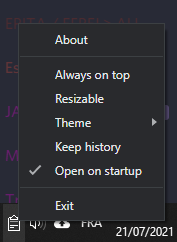

  

# Fast Clipboard Recover
A fluent open source application to recover your copy-paste easily

## Download

Download Fast Clipboard Recover from [GitHub releases](https://github.com/Darkempire78/Fast-Clipboard-Recover/releases/)

## Features

**Add a button to open the current repository on github1s**

* Handle copy of text
* Handle copy of image
* Fast recovering old copy
* Themes (Light/Dark)
* Resizable
* Always on top
* Keep history when the computer reboot
* Auto start

## Shortcut

Open/Hide the window : <kbd>Ctrl</kbd>+<kbd>Shift</kbd>+<kbd>X</kbd>

## Options

## Discord

Join the Discord server !

## Contributing

Pull requests are welcome. For major changes, please open an issue first to discuss what you would like to change.

Please make sure to update tests as appropriate.

## License

This project is under [GPLv3](LICENSE).
